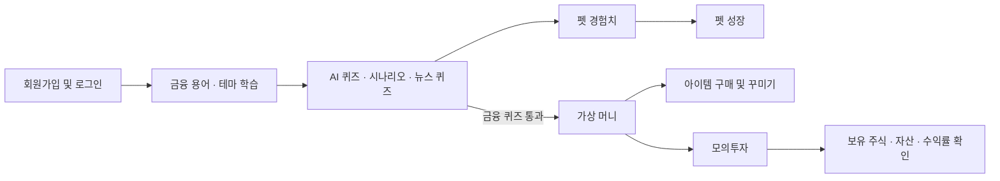
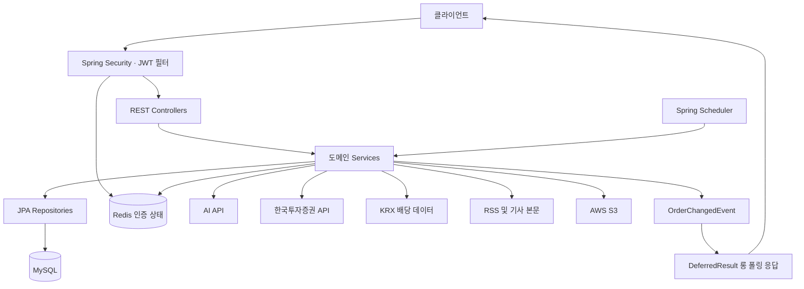

# Jammoney — 금융 학습과 모의투자를 연결하는 백엔드

Jammoney는 금융 용어 학습, AI 퀴즈, 상황별 의사결정 연습, 경제 뉴스 읽기와 모의투자를 하나의 흐름으로 연결하는 서비스입니다. 사용자는 학습으로 펫 경험치와 가상 머니를 얻고, 펫을 꾸미거나 주식 매매를 연습할 수 있습니다.

이 저장소는 **Java 17 · Spring Boot 기반 백엔드**입니다. 한국투자증권 API에서 시장 데이터를 조회하고, 매수·매도 및 자산 계산은 서비스 내부의 가상 자산으로 처리합니다.

## 빠르게 살펴보기

면접이나 코드 검토 시 다음 순서로 읽으면 주요 구현을 파악할 수 있습니다.

| 관심 영역 | 확인할 내용 | 시작 코드 |
| --- | --- | --- |
| 인증과 토큰 수명 관리 | Refresh Token 회전, 해시 저장, TTL, 전체 로그아웃 | [RefreshTokenService](src/main/java/com/example/jammoney/auth/service/RefreshTokenService.java) |
| 주문과 자산 처리 | 호가 비교, 즉시 체결·예약 분기, 잔고·보유 주식 갱신 | [OrderService](src/main/java/com/example/jammoney/stockApp/stock/service/OrderService.java) |
| 주문 변경 알림 | Spring 이벤트와 `DeferredResult`를 연결한 롱 폴링 | [LongPollingController](src/main/java/com/example/jammoney/stockApp/stock/controller/LongPollingController.java) |
| AI와 서비스 로직의 연결 | 선택 이력에 따른 질문 생성, 플레이 기록, 종료 보상 | [ScenarioServiceImpl](src/main/java/com/example/jammoney/scenarioQuiz/service/ScenarioServiceImpl.java) |
| 외부 데이터 재사용 | 증권 API 토큰 재사용, 뉴스 요약 저장 | [KisAuthService](src/main/java/com/example/jammoney/stockApp/kis/service/KisAuthService.java), [NewsService](src/main/java/com/example/jammoney/news/service/NewsService.java) |

## 사용자 흐름과 주요 기능

| 기능 | 구현 내용 |
| --- | --- |
| 회원·인증 | 이메일 회원가입, BCrypt 비밀번호 해싱, JWT 로그인·재발급, 단일 기기·전체 로그아웃, 프로필 조회 |
| 금융 용어·테마 학습 | 카테고리·일차별 용어, 퀴즈 제출, 학습 진도, 나만의 단어장, 테마별 콘텐츠 조회 |
| AI 금융 퀴즈 | 카테고리·난이도별 문제 생성, 정오답·해설·힌트, 오답노트, 결과에 따른 보상 |
| AI 시나리오 | 금융 상황별 선택지와 후속 질문 생성, 선택 이력 저장, 최종 총평 |
| 경제 뉴스 | RSS·기사 본문 수집, 최근 뉴스 조회, AI 요약·퀴즈, 쉬운 용어 풀이 |
| 펫·아이템 | 경험치와 최대 10레벨 성장, 이름 변경, 아이템 구매·장착·판매, 인벤토리 |
| 모의투자 | 종목·호가·분봉 조회, 매수·매도·예약·취소, 관심 종목, 포트폴리오, KOSPI 차트 |
| 이미지 | S3 이미지 업로드, 펫·아이템 이미지 URL 제공 |

예를 들어 금융 퀴즈 결과에서 정답이 3개 이상이면 펫 경험치 10과 가상 머니 10,000을 지급합니다. 시나리오는 종료 시 난이도에 따라 경험치 10·20·30을 지급합니다. 보상 규칙은 [QuizServiceImpl](src/main/java/com/example/jammoney/financeQuiz/service/QuizServiceImpl.java)과 [ScenarioServiceImpl](src/main/java/com/example/jammoney/scenarioQuiz/service/ScenarioServiceImpl.java)에서 확인할 수 있습니다.

## 기술 구성

버전은 저장소의 [build.gradle](build.gradle), [Gradle Wrapper](gradle/wrapper/gradle-wrapper.properties), [docker-compose.yml](docker-compose.yml)을 기준으로 작성했습니다.

| 구분 | 기술 | 사용 위치 |
| --- | --- | --- |
| 언어·빌드 | Java 17, Gradle 8.13 | 애플리케이션 빌드·실행 |
| 웹·보안 | Spring Boot 3.4.5, Spring MVC, Spring Security, JJWT 0.11.5 | REST API, 인증 필터, 토큰 발급 |
| 영속성 | Spring Data JPA, MySQL | 사용자·학습·주문·자산·뉴스 저장 |
| 인증 상태 | Spring Data Redis, Redis 7 | Refresh Token 메타데이터·해시, Access Token 블랙리스트, 무효화 버전 |
| 외부 HTTP 연동 | WebClient, RestTemplate | AI 생성, 증권 시세·토큰 조회 |
| 데이터 변환·수집 | MapStruct 1.5.5.Final, Jsoup 1.17.2, Apache POI 5.2.5 | DTO 매핑, 뉴스 수집, KRX 배당 Excel 파싱 |
| 파일 저장 | AWS S3 | 이미지 업로드·조회 |
| 테스트 | JUnit 5, Mockito, MockMvc, Testcontainers 1.19.7 | 서비스 단위 테스트, API·Redis 연동 테스트 |
| 배포 구성 | Docker, Docker Compose, GitHub Actions | 이미지 빌드, 레지스트리 업로드, SSH 배포 |

## 아키텍처

하나의 Spring Boot 애플리케이션 안에서 도메인별 패키지를 나누고, 각 도메인을 Controller → Service → Repository로 구성합니다. Redis는 인증 상태를 관리하며, 주문과 시세 데이터는 JPA를 통해 MySQL에 저장합니다.

### 1. JWT 인증에 서버 측 무효화 상태 결합

로그인 시 Access Token은 응답 본문으로, Refresh Token은 `HttpOnly · Secure · SameSite=None` 쿠키로 전달합니다. Refresh Token의 SHA-256 해시와 메타데이터를 Redis에 저장하고, 토큰 만료 시각에 맞춰 TTL을 적용합니다.

- **재발급:** 저장된 해시와 사용자 정보를 검증한 후 기존 Refresh Token을 삭제하고 새 토큰으로 교체합니다.
- **단일 기기 로그아웃:** 해당 Refresh Token을 삭제합니다. 요청 본문에 Access Token이 있으면 남은 유효시간 동안 블랙리스트에 등록합니다.
- **전체 로그아웃:** 사용자의 무효화 버전 `ver`를 증가시키고 Refresh Token들을 삭제합니다. 인증 필터는 이전 버전의 Access Token을 거부합니다.
- **Redis 저장:** 토큰 메타데이터·해시 매핑·사용자별 해시 집합을 `MULTI/EXEC`로 함께 저장합니다. 재발급 전체의 검증·삭제·생성 과정은 별도 단계로 수행됩니다.

검토 지점: [AuthController](src/main/java/com/example/jammoney/auth/controller/AuthController.java), [JwtAuthenticationFilter](src/main/java/com/example/jammoney/auth/jwt/JwtAuthenticationFilter.java), [RefreshTokenRepositoryImpl](src/main/java/com/example/jammoney/auth/repository/RefreshTokenRepositoryImpl.java).
